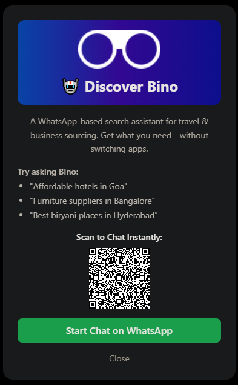

# 🧩 Bino Widget

An embeddable widget to promote **Bino**, a WhatsApp-based smart search bot for travel and business sourcing.

![Preview Screenshot] 

## 🚀 Features
- Floating “Try Bino” button with animation
- Modal popup with Bino branding
- Live QR Code generator to initiate chat
- Responsive and stylish using TailwindCSS
- Embed-friendly: easy to plug into blogs or personal sites

## 🛠️ Technologies
- HTML + CSS (Tailwind)
- JavaScript (DOM + QRCode.js)

## 🧩 How to Use
1. Clone the repo:
   ```bash
   git clone https://github.com/Keerthan-01/Bino.git
   ```
2. Open `index.html` in your browser.
3. Customize logo, QR link, and sample queries as needed.

## 📦 Deployment
You can deploy it on:
- [x] Netlify (drop folder)
- [x] GitHub Pages
- [x] Vercel


